# คู่มือการใช้งานระบบจองห้องซ้อม

**Room Reserve · ภาควิชาดนตรีตะวันตก คณะศิลปกรรมศาสตร์ จุฬาลงกรณ์มหาวิทยาลัย**
อาคารศิลปกรรม ชั้น 3 · เว็บไซต์ `https://roomreserve.yos.in.th`

---

## ภาพรวมระบบ

| หัวข้อ | รายละเอียด |
|---|---|
| เวลาเปิด | จันทร์–ศุกร์ 08:00–20:00 น. (รอบสุดท้ายเริ่ม 19:00) · ปิดเสาร์–อาทิตย์ |
| หน่วยการจอง | ครั้งละ 1 ชั่วโมง เริ่มตรงต้นชั่วโมงเสมอ |
| ห้องทั้งหมด | 13 ห้อง: ห้องซ้อม 1–10, ห้อง 301, ห้อง 303 และห้อง 304 |

### ผู้ใช้ 3 ระดับ

| ระดับ | ทำอะไรได้ |
|---|---|
| นิสิต | จอง ใช้ห้องทันที เช็คอิน ยกเลิก และย้ายห้อง |
| อาจารย์ | ดูตารางห้อง และอนุมัติคำขอจองห้อง 301 (เมื่อได้รับแต่งตั้ง) |
| แอดมิน / เจ้าหน้าที่ | อนุมัติคำขอ จัดการผู้ใช้ ปิดห้อง พิมพ์ป้าย QR และดูสถิติ |

<section class="level student" markdown="1">

## ส่วนที่ 1 · นิสิต

### 1.1 สมัครใช้งาน (ครั้งแรกครั้งเดียว)

1. กด **ลงทะเบียน** แล้วกรอกรหัสนิสิต อีเมล `@student.chula.ac.th` ชื่อ และเครื่องดนตรีหลัก
2. เปิดอีเมลยืนยัน กดลิงก์ แล้วตั้งรหัสผ่าน
3. ถ้ารหัสนิสิตและอีเมลตรงกับรายชื่อของภาควิชา บัญชีจะได้รับอนุมัติทันที ถ้าไม่ตรง ต้องรอเจ้าหน้าที่อนุมัติ (ดูสถานะได้ที่หน้า **สถานะบัญชี**)

<figure class="phone">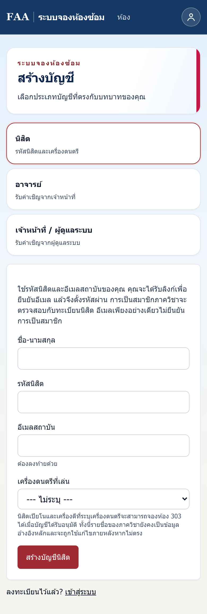<figcaption>หน้าลงทะเบียน</figcaption></figure>
<figure class="phone">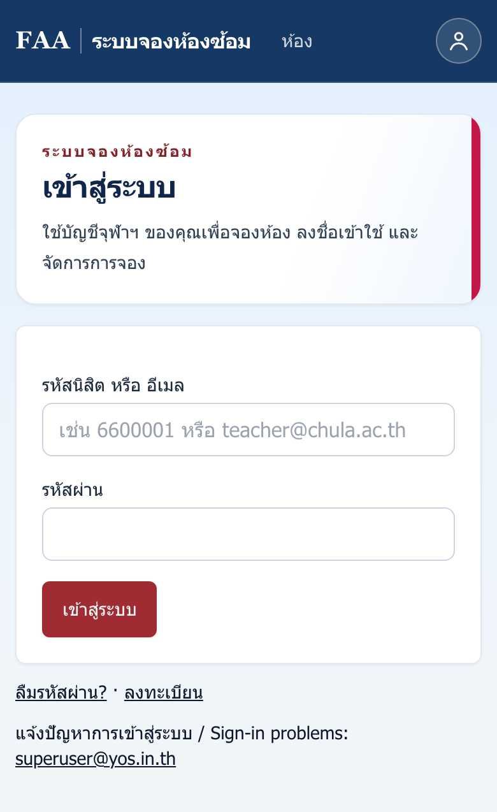<figcaption>หน้าเข้าสู่ระบบ ใช้รหัสนิสิตและรหัสผ่าน</figcaption></figure>

**ข้อพึงระวัง** ต้องใช้อีเมลนิสิต `@student.chula.ac.th` เท่านั้น อีเมล Gmail ส่วนตัวใช้สมัครไม่ได้

### 1.2 จองล่วงหน้า

1. เปิดหน้า **ห้อง** (ตารางทุกห้อง) หรือ **เลือกห้อง** (ดูทุกห้องในชั่วโมงเดียวกัน)
2. เลือกวันและชั่วโมงที่ว่าง แล้วกด **จองห้องนี้**
3. ใส่รายละเอียด (ไม่บังคับ) เช่น หัวข้อ วัตถุประสงค์ หรือชื่อผู้ร่วมซ้อม แล้วกด **ยืนยันการจอง**
4. ระบบส่งอีเมลยืนยันการจอง และส่งอีเมลเตือนอีกครั้ง **30 นาทีก่อนเวลา**

<figure class="phone">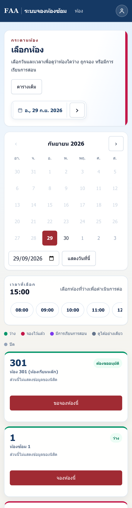<figcaption>หน้าเลือกห้อง: เลือกวันและเวลา แล้วดูว่าห้องไหนว่าง</figcaption></figure>
<figure class="phone">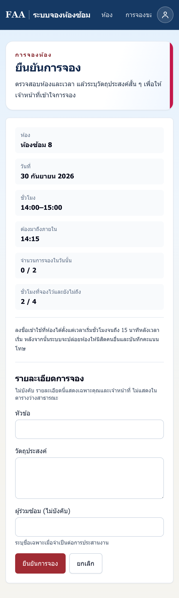<figcaption>หน้ายืนยันการจอง: แสดงเวลาที่ต้องมาเช็คอินและจำนวนที่จองไปแล้ว</figcaption></figure>

### 1.3 กฎการจอง

| กฎ | ค่าที่ใช้ |
|---|---|
| จองล่วงหน้าได้ | 2 วัน (นับรวมวันนี้) |
| จำนวนครั้งต่อวัน | ไม่เกิน 2 ครั้ง รวมทุกห้อง |
| ชั่วโมงที่ถือไว้พร้อมกัน | ไม่เกิน 4 ชั่วโมงที่ยังไม่ถึงเวลา พอชั่วโมงหนึ่งจบ ก็จองเพิ่มได้ |
| จองซ้ำทุกสัปดาห์ | ไม่มี ต้องจองเองทุกครั้ง |

### 1.4 เช็คอินที่ประตูห้อง ★ สำคัญที่สุด

1. ไปถึงห้องแล้ว **สแกน QR code ที่ติดอยู่หน้าประตูห้องนั้น**
2. เข้าสู่ระบบ (ถ้ายังไม่ได้เข้า) แล้วกดปุ่ม **ลงชื่อเข้าใช้สำหรับการจองนี้**
3. เช็คอินได้ตั้งแต่ **ต้นชั่วโมง จนถึง 15 นาทีหลังเริ่ม** เช่น จอง 14:00 ต้องเช็คอินระหว่าง 14:00–14:15

<figure class="phone">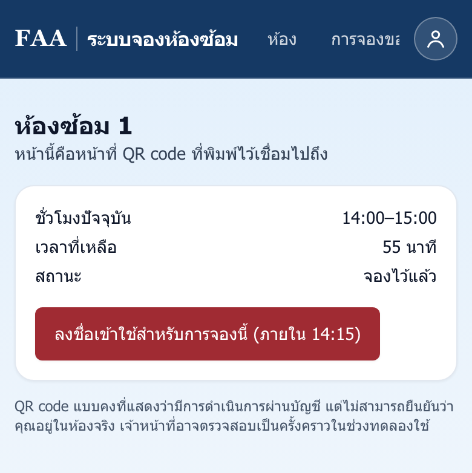<figcaption>สแกนตรงเวลา: มีปุ่มเช็คอินพร้อมเวลาปิด</figcaption></figure>
<figure class="phone">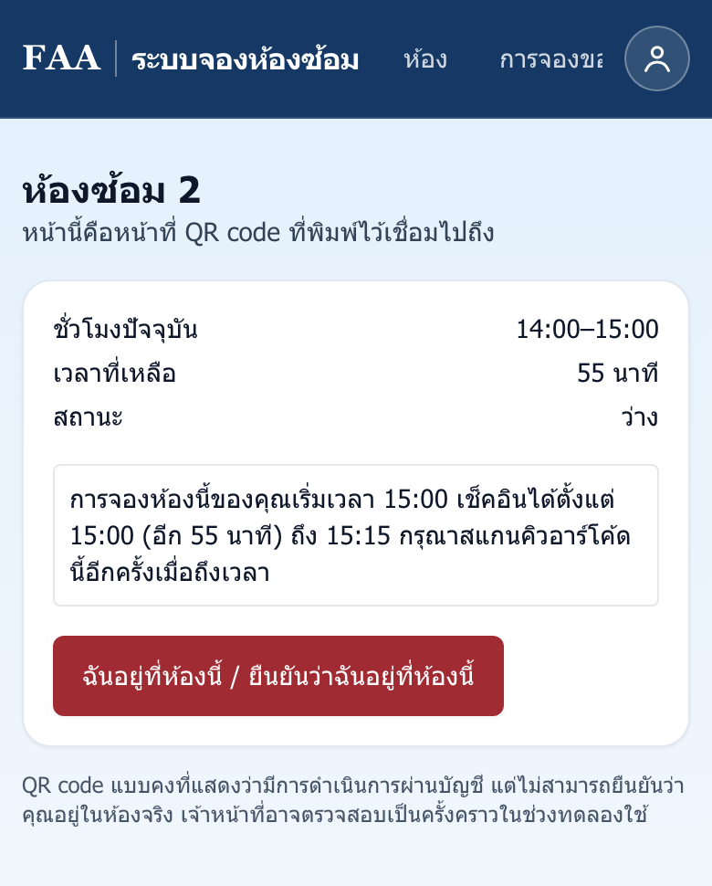<figcaption>มาก่อนเวลา: บอกว่าเช็คอินได้กี่โมงและอีกกี่นาที</figcaption></figure>

ถ้าสแกนแล้วไม่มีปุ่มเช็คอิน หน้าจอจะบอกเหตุผลไว้ ดังนี้

| ข้อความที่เห็น | ความหมาย | ทำอย่างไร |
|---|---|---|
| "เช็คอินได้ตั้งแต่ 15:00 (อีก 55 นาที)" | มาก่อนเวลา | รอแล้วสแกนใหม่เมื่อถึงเวลา |
| "ยังรอการอนุมัติจากเจ้าหน้าที่" | ห้อง 301, 303 หรือ 304 ที่ยังไม่ได้รับอนุมัติ | ดูผลที่หน้า **การจองของฉัน** |
| "การจองชั่วโมงนี้ของคุณอยู่ที่ห้อง X" | มาผิดห้อง | ไปสแกนที่ประตูห้อง X |
| "การเช็คอินปิดไปแล้วเมื่อ 14:15" | มาสายเกินเวลา | ห้องถูกปล่อยให้ผู้อื่น ถ้ามาตรงเวลาจริง ติดต่อสำนักงาน |

<figure class="phone">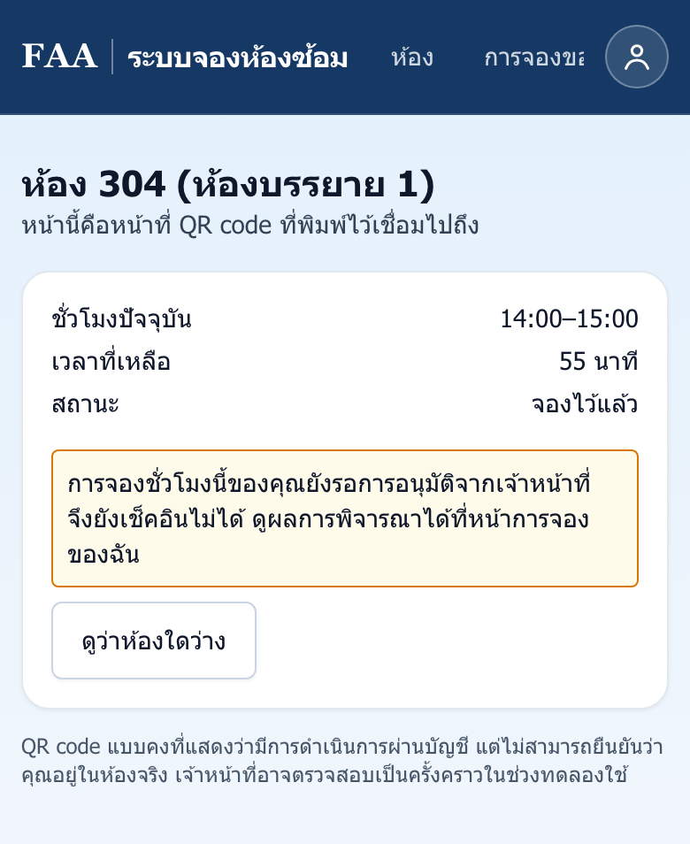<figcaption>รออนุมัติ</figcaption></figure>
<figure class="phone">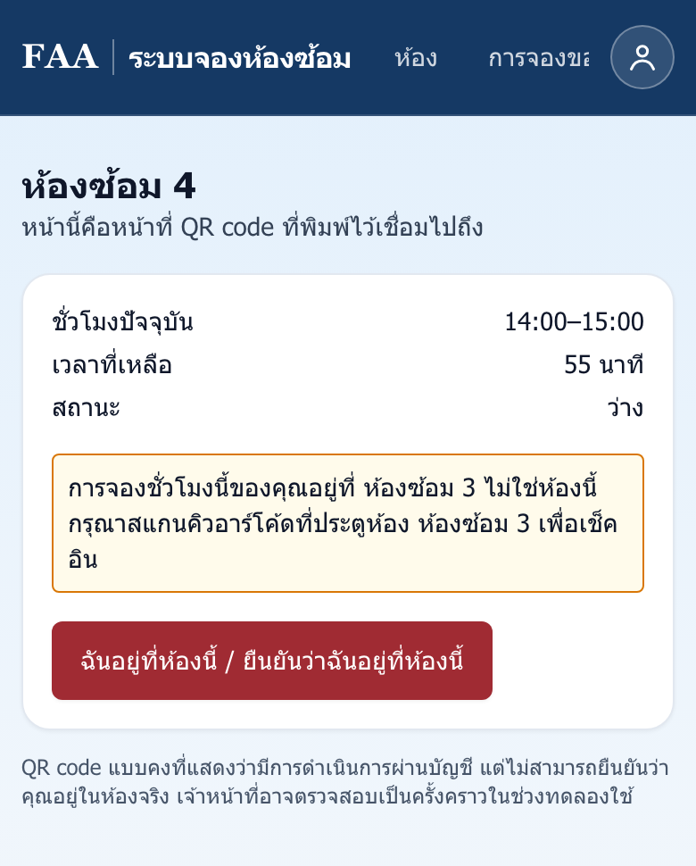<figcaption>มาผิดห้อง</figcaption></figure>
<figure class="phone">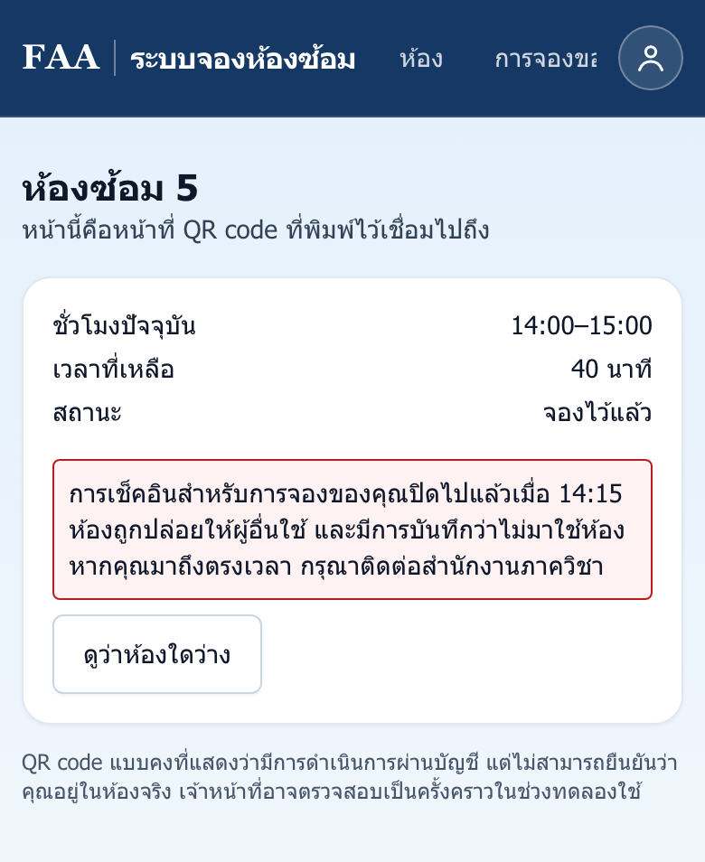<figcaption>เช็คอินปิดแล้ว</figcaption></figure>

**ข้อพึงระวัง** เช็คอินจากอีเมลหรือจากหน้า **การจองของฉัน** ไม่ได้ ต้องสแกน QR ที่ประตูห้องเท่านั้น

### 1.5 ใช้ห้องทันที (Walk-in)

- ถ้าห้องว่างในชั่วโมงนี้ ให้สแกน QR ที่ประตูแล้วกด **ฉันอยู่ที่ห้องนี้** หรือกด **ใช้ตอนนี้** จากตาราง
- การใช้จะสิ้นสุดตอนจบชั่วโมงเสมอ เช่น เริ่ม 14:50 ใช้ได้ถึง 15:00
- ห้อง **301, 303 และ 304** ใช้แบบ Walk-in ไม่ได้ ต้องขอจองล่วงหน้า

<figure class="phone">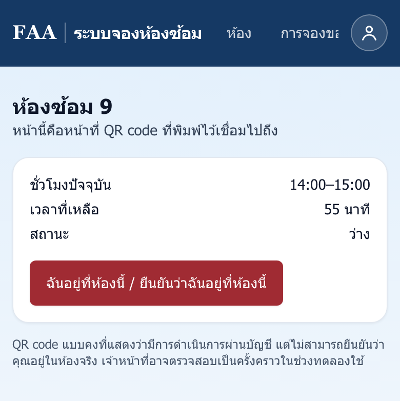<figcaption>ห้องว่าง: กด "ฉันอยู่ที่ห้องนี้" เพื่อใช้ทันที</figcaption></figure>
<figure class="phone">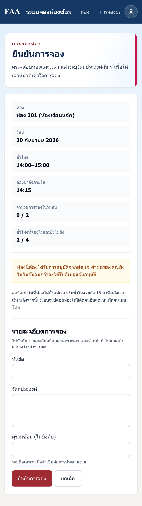<figcaption>ขอจองห้อง 301: ต้องรออีเมลแจ้งอนุมัติก่อน</figcaption></figure>

### 1.6 ห้องพิเศษ

| ห้อง | เงื่อนไข |
|---|---|
| **301** ห้องเรียนหลัก | ขอจองล่วงหน้าได้เฉพาะชั่วโมงที่ไม่มีเรียน **ต้องได้รับอนุมัติจากอาจารย์หรือแอดมิน** |
| **303** | สำหรับนิสิตเปียโนและเครื่องกระทบ ต้องจองล่วงหน้าและรอเจ้าหน้าที่อนุมัติ |
| **304** ห้องบรรยาย | จองได้ในชั่วโมงที่ไม่มีเรียน ต้องรออนุมัติ |

### 1.7 ยกเลิก แก้ไข และย้ายห้อง

- จัดการได้ที่หน้า **การจองของฉัน** ก่อนเวลาเริ่ม
- ยกเลิกภายใน 1 ชั่วโมงก่อนเริ่ม ระบบจะบันทึกเป็น "ยกเลิกกระชั้นชิด" (ไม่นับเป็นคะแนนโทษ)
- เมื่อถึงเวลาเริ่มแล้ว จะยกเลิกไม่ได้
- กด **เพิ่มลงปฏิทิน** เพื่อดาวน์โหลดไฟล์ปฏิทิน (.ics) ไปใส่ในมือถือ

<figure class="phone single">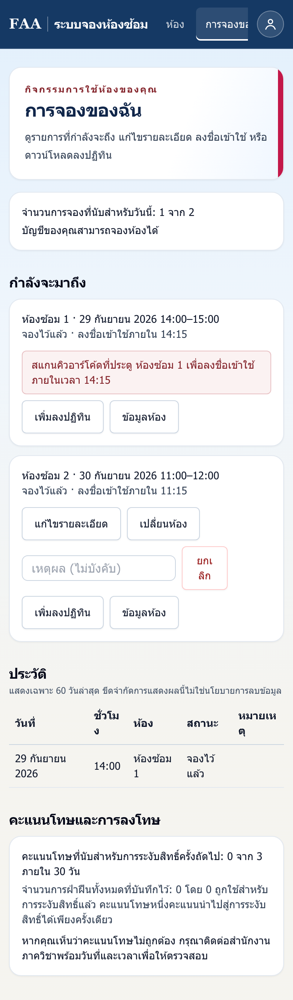<figcaption>หน้าการจองของฉัน: รายการที่กำลังจะมาถึง ประวัติ และคะแนนโทษ</figcaption></figure>

### 1.8 คะแนนโทษและการระงับสิทธิ์

| เหตุการณ์ | ผล |
|---|---|
| ไม่เช็คอินภายในเวลา (No-show) | ได้ **คะแนนโทษ 1 คะแนน** และห้องถูกปล่อยให้ผู้อื่น |
| คะแนนโทษครบ **3 คะแนนภายใน 30 วัน** | **ระงับสิทธิ์การจอง 7 วัน** และการจองที่มีอยู่ถูกยกเลิก |
| คิดว่าได้คะแนนโทษไม่ถูกต้อง | ติดต่อสำนักงานภาควิชา พร้อมแจ้งวันและเวลา |

**Tips สำหรับนิสิต**

- บันทึกหน้าเว็บไว้ที่หน้าจอมือถือ (Add to Home Screen) จะได้เปิดเร็ว
- ตั้งเตือนในมือถือเผื่อไว้ 10 นาทีก่อนเวลา นอกเหนือจากอีเมลเตือน 30 นาที
- ถ้าไม่ได้ใช้ห้องแล้ว **ให้ยกเลิกทันที** ห้องจะว่างให้เพื่อน และคุณไม่เสียคะแนนโทษ
- ถ้าห้องที่ต้องการเต็ม ลองหน้า **เลือกห้อง** ซึ่งแสดงทุกห้องในชั่วโมงเดียวกัน
- ถ้าอีเมลไม่มา ให้ดูในโฟลเดอร์ Junk หรือ Spam ก่อน
- ถ้าลิงก์ในอีเมล Outlook กดแล้วขึ้นหน้าตรวจความปลอดภัยของ Microsoft ให้คัดลอกลิงก์ไปวางในเบราว์เซอร์แทน

</section>

<section class="level teacher" markdown="1">

## ส่วนที่ 2 · อาจารย์

### 2.1 รับบัญชี

- อาจารย์ **สมัครเองไม่ได้** เจ้าหน้าที่จะส่งอีเมลคำเชิญให้
- กดลิงก์ในอีเมลคำเชิญเพื่อตั้งรหัสผ่าน (ลิงก์มีอายุ 14 วัน)
- เข้าสู่ระบบด้วย **อีเมล** แทนรหัสนิสิต

### 2.2 สิ่งที่ทำได้

- ดูตารางห้องทั้งหมด ทั้งรายวัน รายสัปดาห์ และหน้าเลือกห้อง
- ดูชั่วโมงเรียนที่ระบบกันไว้ (ห้อง 301 และ 304)
- บัญชีอาจารย์ **จองห้องหรือเช็คอินเองไม่ได้** ถ้าต้องการใช้ห้องเพื่อกิจกรรมพิเศษ ให้แจ้งเจ้าหน้าที่ปิดห้องให้

<figure class="desktop">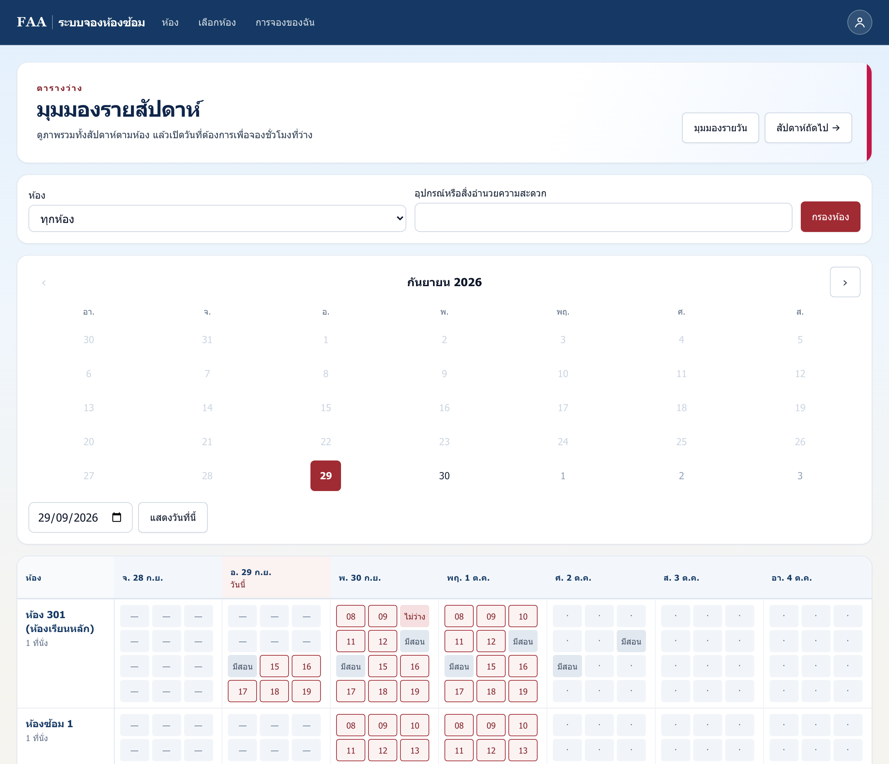<figcaption>มุมมองรายสัปดาห์: เห็นทุกห้องและชั่วโมงเรียนที่กันไว้</figcaption></figure>

### 2.3 อนุมัติคำขอจองห้อง 301

อาจารย์ที่แอดมินแต่งตั้งเป็น **ผู้ดูแลห้อง 301** จะเห็นเมนู **ดูแลห้อง** ในเมนูบัญชี (ไอคอนรูปคนมุมขวาบน)

1. เปิดเมนู **ดูแลห้อง** จะเห็นรายการ **คำขอที่รอการอนุมัติ**
2. อ่านรายละเอียด (หัวข้อ วัตถุประสงค์ ผู้ขอ) ใส่หมายเหตุถ้าต้องการ
3. กด **อนุมัติ** หรือ **ไม่อนุมัติ** ระบบจะส่งอีเมลแจ้งผลให้นิสิตทันที

<figure class="desktop">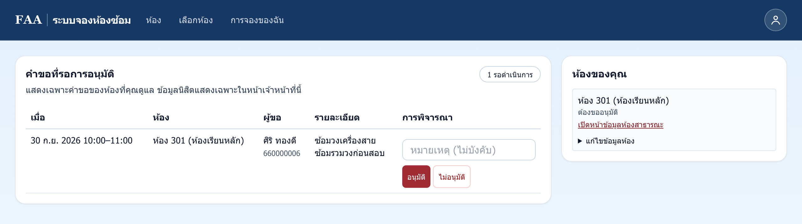<figcaption>หน้าดูแลห้องของอาจารย์: เห็นเฉพาะคำขอของห้องที่ตนดูแล</figcaption></figure>

**Tips สำหรับอาจารย์**

- ตอบคำขอให้เร็ว นิสิตต้องได้รับอนุมัติ **ก่อนเวลาเริ่ม** จึงจะเช็คอินได้
- ถ้าตารางสอนเปลี่ยน ให้แจ้งเจ้าหน้าที่แก้ชั่วโมงเรียนในระบบ นิสิตจะได้ไม่จองชนกับเวลาเรียน
- ถ้าลืมรหัสผ่าน ให้กด **ลืมรหัสผ่าน** ที่หน้าเข้าสู่ระบบ หรือขอลิงก์ตั้งรหัสผ่านจากแอดมินโดยตรง

</section>

<section class="level admin" markdown="1">

## ส่วนที่ 3 · แอดมินและเจ้าหน้าที่

### 3.1 เมนูเจ้าหน้าที่

| เมนู | ใช้ทำอะไร |
|---|---|
| **วันนี้** | ดูการจองวันนี้ เช็คอินแทนนิสิต จบการใช้ก่อนเวลา |
| **อนุมัติการจองห้อง** | อนุมัติหรือปฏิเสธคำขอห้อง 301, 303 และ 304 |
| **ผู้ใช้** | ค้นหาผู้ใช้ ระงับสิทธิ์ ยกเลิกคะแนนโทษ ปิดบัญชี |
| **คำเชิญ** | เชิญเจ้าหน้าที่และอาจารย์ |
| **ทะเบียนนิสิต** | นำเข้าหรือส่งออกรายชื่อ และแก้อีเมลนิสิต |
| **การปิดห้อง / ปฏิทิน** | ปิดห้องชั่วคราว กำหนดวันหยุด |
| **เหตุขัดข้อง** | บันทึกเหตุขัดข้อง ระบบยกเลิกการจองโดยไม่ลงโทษนิสิต |
| **คิวอีเมล** | ดูอีเมลที่ส่งไม่สำเร็จ |
| **สถิติ / บันทึกการตรวจสอบ** | รายงานการใช้งานและประวัติการแก้ไข |
| **ป้ายติดห้อง** | พิมพ์ป้าย QR ติดประตูห้อง |
| **การตั้งค่า** | แก้ข้อมูลห้อง และแต่งตั้งผู้ดูแลห้อง (เฉพาะ Maintainer) |

<figure class="desktop">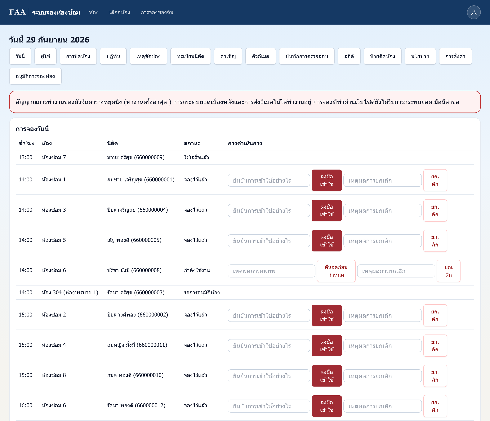<figcaption>หน้าวันนี้: ภาพรวมการใช้ห้องของวัน</figcaption></figure>

### 3.2 งานประจำ

- **ทุกเช้า:** เปิด **วันนี้** และ **อนุมัติการจองห้อง** เพื่อตอบคำขอที่ค้างอยู่
- **เชิญเจ้าหน้าที่หรืออาจารย์ใหม่:** ไปที่ **คำเชิญ** ใส่อีเมล แล้วติ๊ก **เจ้าหน้าที่** หรือ **อาจารย์**
- **แต่งตั้งอาจารย์ผู้อนุมัติห้อง 301 (เฉพาะ Maintainer):** ไปที่ **การตั้งค่า** → ห้อง 301 → เพิ่มผู้ดูแลห้อง แล้วเลือกบัญชีอาจารย์ (ต้องเชิญอาจารย์เข้าระบบก่อน)
- **ถ้าอีเมลไม่ถึง (เฉพาะ Maintainer):** ไปที่ **ผู้ใช้** → จัดการ → **สร้างลิงก์ตั้งรหัสผ่านใหม่** แล้วส่งลิงก์ให้เจ้าของบัญชีทาง LINE (ใช้ได้ครั้งเดียว มีอายุ 24 ชั่วโมง)
- **นิสิตอุทธรณ์คะแนนโทษ:** ไปที่ **ผู้ใช้** → จัดการ → คะแนนโทษ → **ยกเลิกคะแนนโทษ** พร้อมใส่เหตุผล

<figure class="desktop">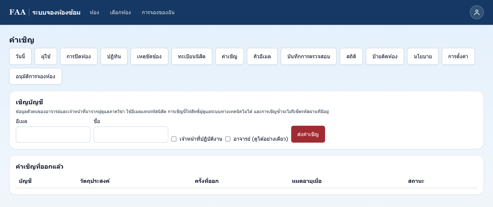<figcaption>หน้าคำเชิญ</figcaption></figure>
<figure class="desktop">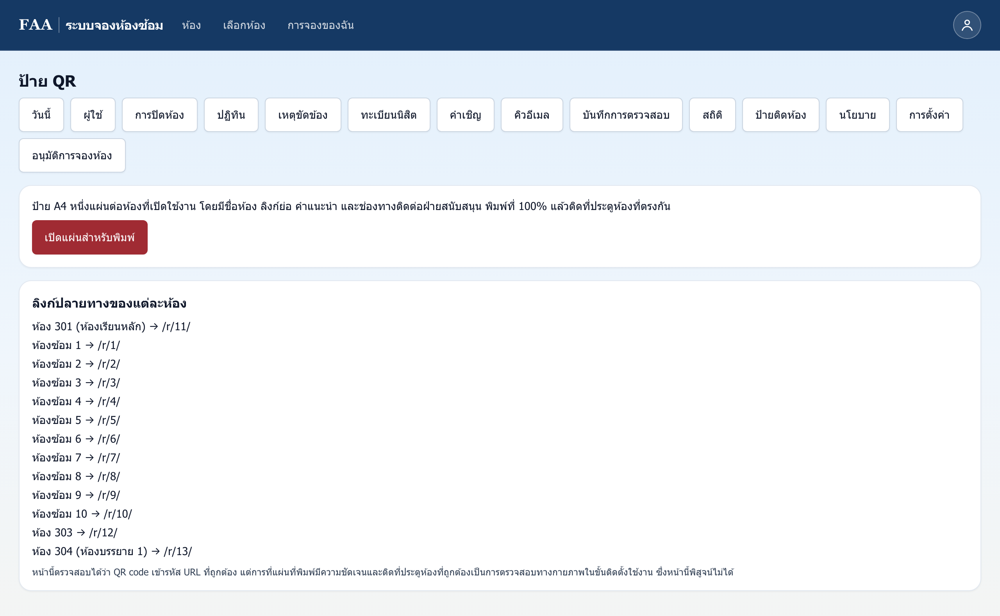<figcaption>หน้าป้ายติดห้อง</figcaption></figure>

**ข้อพึงระวัง**

- **พิมพ์ป้าย QR จากเมนูป้ายติดห้องเท่านั้น** เพราะเมนูนี้ใช้ที่อยู่เว็บที่ถูกต้อง
- **การปิดห้องจะยกเลิกการจองในช่วงนั้นทันที** และการเปิดห้องคืนจะไม่ได้การจองเหล่านั้นกลับมา
- **เจ้าหน้าที่สร้างการจองแทนนิสิตไม่ได้** เพื่อไม่ให้มีการข้ามกฎ
- **ห้ามแชร์ลิงก์ตั้งรหัสผ่านในกลุ่มแชท** ให้ส่งถึงเจ้าของบัญชีโดยตรงเท่านั้น
- **ระบบมีข้อมูลส่วนบุคคลของนิสิต** ห้ามส่งออกรายชื่อไปเก็บในที่ที่ไม่ปลอดภัย

**Tips สำหรับแอดมิน**

- ถ้าเห็นอีเมลค้างใน **คิวอีเมล** มักเกิดจากรหัสผ่านอีเมลของระบบเปลี่ยน ให้ติดต่อผู้ดูแลเซิร์ฟเวอร์
- ตรวจดูหน้า **สถิติ** ทุกเดือน ห้องที่มี No-show สูงอาจต้องปรับกฎหรือแจ้งนิสิต
- ช่วงนำร่องให้สุ่มตรวจหน้าห้อง เพราะ QR ยืนยันได้ว่าสแกนแล้ว แต่ยืนยันไม่ได้ว่าอยู่ในห้องจริง

</section>

## ติดต่อ

**คุณสิตานันท์ (พี่ดิว)** · โทร 02-218-4604 · อีเมล `superuser@yos.in.th`
ภาควิชาดนตรีตะวันตก คณะศิลปกรรมศาสตร์ จุฬาลงกรณ์มหาวิทยาลัย

ภาพหน้าจอในคู่มือนี้ใช้ข้อมูลตัวอย่าง ไม่ใช่ข้อมูลนิสิตจริง

